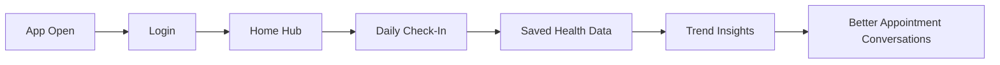

# Slide: User Flow and Business Outcome (Executive Audience)

## Headline

A simple daily flow that turns check-ins into actionable health visibility.

## Diagram

## Speaker Script (4 Points)

1. Users can complete their daily check-in quickly through a clear, repeatable path.
2. The flow captures structured data that accumulates into useful trends over time.
3. The trend view turns daily inputs into insights users can discuss with healthcare providers.
4. This journey supports retention because users return for both logging and insight value.

## Room-Fit Notes

- Best for instructors, stakeholders, product owners, or non-technical audiences.
- Focus on value, outcomes, and behavior change rather than implementation detail.
