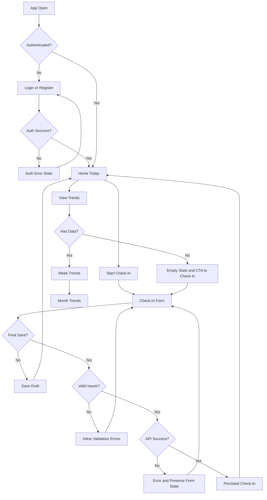

# Slide: User Flow and System Behavior (Technical Audience)

## Headline

Authenticated flow with explicit validation, error recovery, and data-state handling.

## Diagram

## Speaker Script (4 Points)

1. Entry is gated by authentication with a defined retry path for auth failures.
2. Check-In supports draft and final save with field validation before persistence.
3. Network failures are recoverable because form state is preserved for user retry.
4. Trends handle both data-present and empty-data states with a clear recovery action.

## Room-Fit Notes

- Best for developers, TAs, technical reviewers, and architecture discussions.
- Focus on state transitions, failure handling, and implementation confidence.
