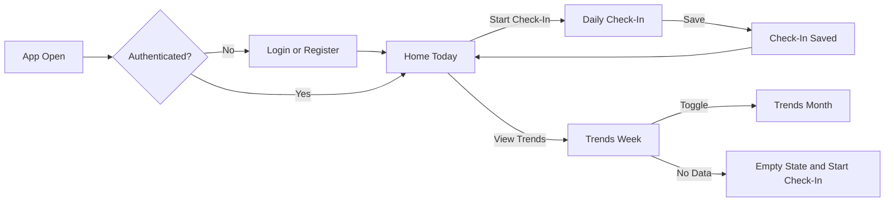

# Slide: User Flow Through the App

## Headline

From App Open to Daily Insight in Under 90 Seconds

## Diagram

## Speaker Script (4 Points)

1. The flow starts at app open, then branches based on authentication.
2. Home is the central hub with two primary actions: Start Check-In and View Trends.
3. Check-In is optimized for quick completion and always returns the user to Home after save.
4. Trends supports week and month views, and if data is missing, the user is guided back to start a check-in.

## Slide Notes

- Keep this to one minute during presentation.
- Emphasize low friction and clear recovery paths.
- Mention reminders and profile paths as planned extensions.
