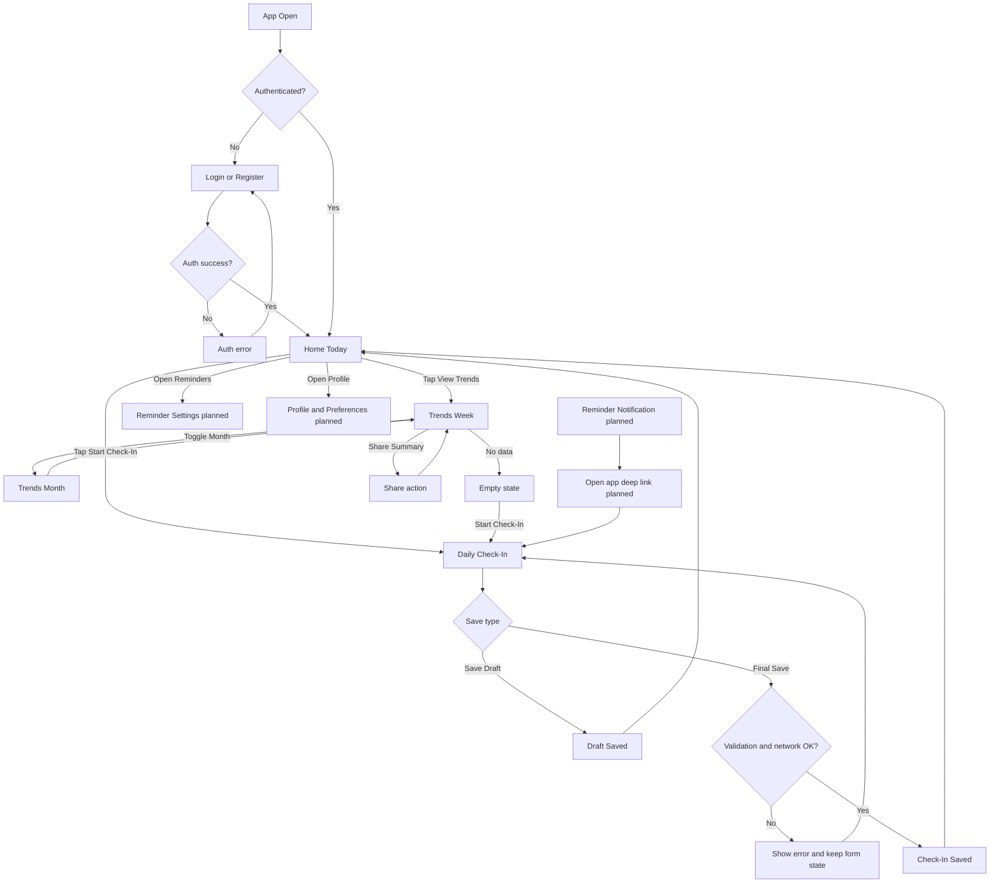

# One-Page User Flow (Class Presentation)

## Goal

Show the complete user journey from entry point to key outcomes in a single page.

## Flow Legend

- Box = screen or system state
- Arrow label = user action or result
- Diamond = decision point

## Main User Flow

## What This Proves

- Clear entry point and authentication branch
- End-to-end completion path for Daily Check-In
- Insight path for Trends and recovery path for empty data
- Planned reminder re-entry loop

## 30-Second Talk Track

1. User opens the app and either logs in or lands on Home.
2. From Home, the two core actions are Start Check-In and View Trends.
3. Check-In supports draft and final save, with validation and network error recovery.
4. Trends supports week and month views, sharing, and no-data fallback back to Check-In.
