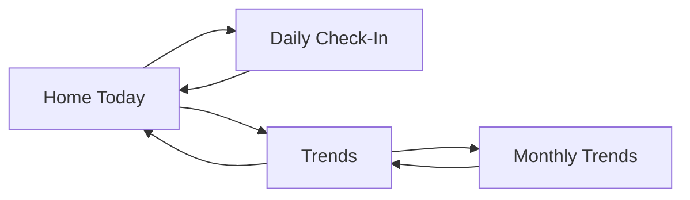
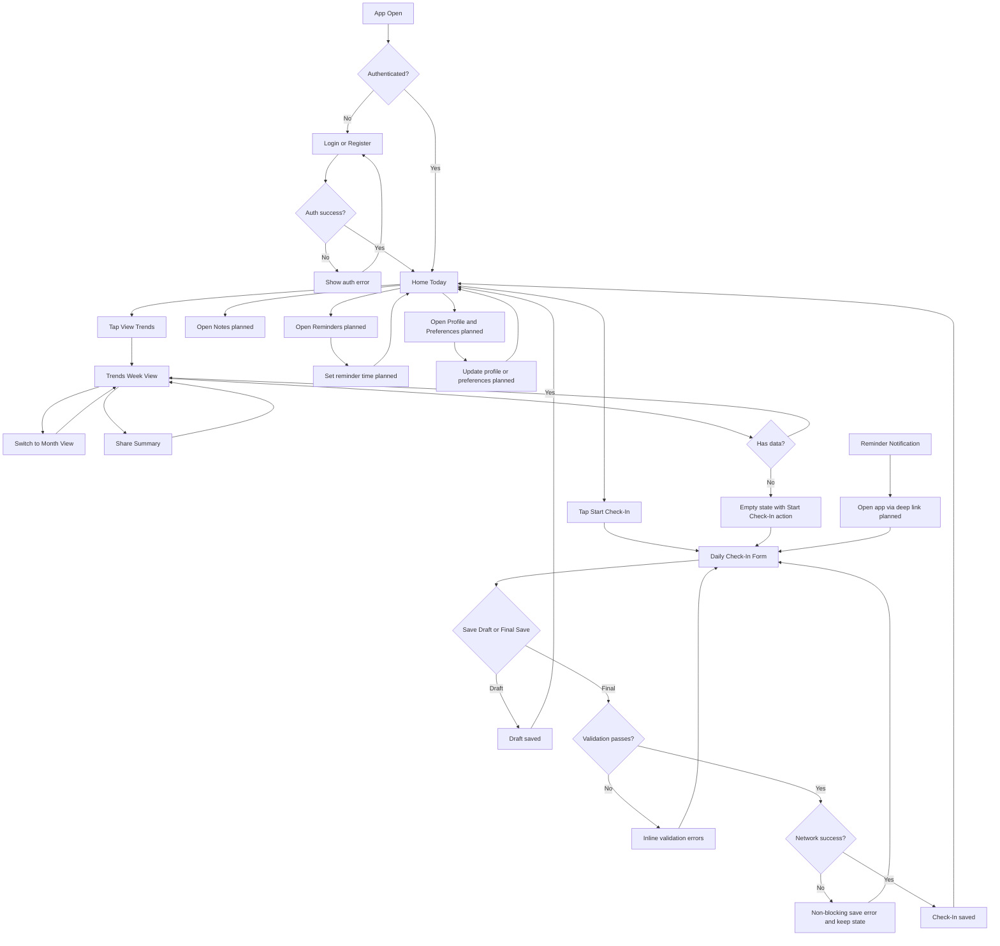

# UX Design Spec: User Flows and Wireframes

## 1. Purpose

This document translates the Week 3 UX board into implementation-ready flows for the frontend and backend teams.

Source design board:

- docs/architecture.excalidraw

## 2. Product Goal

Help women over 40 complete a fast daily health check-in, review trends, and prepare concise health summaries for appointments.

## 3. Design Principles

- Calm and low-friction: reduce typing and decision fatigue.
- One-handed mobile use: large tap targets and clear hierarchy.
- Fast capture, useful insight: complete check-ins quickly and see trends immediately.
- Private by default: authenticated, user-scoped health data.

## 4. Information Architecture

Primary app areas:

- Home/Today
- Daily Check-In
- Trends
- Notes (planned)
- Reminders (planned)
- Profile and Preferences (planned)

## 5. Primary User Flows

### Flow A: Home to Daily Check-In to Save

Entry condition:

- User is authenticated and opens app.

Steps:

1. User lands on Home/Today and sees next check-in time.
2. User taps Start Check-In.
3. User sets mood, sleep, and energy values.
4. User adds symptom selections.
5. User taps Save Draft or complete save action.
6. User returns to Home with updated daily status.

Success criteria:

- User can complete core check-in inputs in under 90 seconds.
- Save succeeds with visible confirmation.
- Home reflects latest same-day values.

Failure and edge handling:

- If network fails, show non-blocking error and keep local form state.
- If required inputs are missing, show inline validation and focus next required control.

### Flow B: Home to Trends Review

Entry condition:

- User has at least one historical check-in.

Steps:

1. User taps View Trends from Home.
2. User sees week overview for sleep, mood, and energy.
3. User reads generated insight bullets.
4. User switches to monthly view.
5. User optionally taps Share Summary.

Success criteria:

- Trends load in under 2 seconds on normal network.
- Week and month views display consistent metric definitions.
- Insights are understandable without clinical terminology.

Failure and edge handling:

- If no data exists, show empty state with action to Start Check-In.
- If partial data exists, render available series and mark missing values clearly.

### Flow C: Reminder-Driven Return (Planned)

Entry condition:

- Reminder notification is scheduled and enabled.

Steps:

1. User receives reminder.
2. User opens app from notification.
3. App deep-links to Home or Check-In with context.
4. User completes check-in.

Success criteria:

- Reminder opens the app to relevant destination.
- Completion rate improves for users with reminders enabled.

## 6. Wireframe Set and Screen Contracts

Wireframe source on UX board:

- Home/Today
- Daily Check-In
- Trends

### Screen Contract: Home/Today

Core content:

- Greeting and next check-in time
- Quick actions: Start Check-In, View Trends
- Today summary chips/bars for mood, sleep, energy
- Focus list for high-priority items

Primary actions:

- Start Check-In
- View Trends

Data dependencies:

- Current user profile
- Most recent check-in for current day
- Reminder schedule

### Screen Contract: Daily Check-In

Core content:

- Progress indicator
- Mood, sleep, energy controls
- Symptom selection list
- Save action

Primary actions:

- Save Draft
- Final Save (if split state is implemented)

Data dependencies:

- Symptom catalog or predefined options
- Existing draft for current date (optional)

Validation rules:

- Mood, sleep, and energy are required for final save.
- Symptom selection is optional.

### Screen Contract: Trends

Core content:

- Week overview by metric
- Insight bullets
- View Month action
- Share Summary action

Primary actions:

- Toggle time range
- Share summary

Data dependencies:

- Historical check-ins grouped by day/week/month
- Insight generator logic (rule-based for MVP)

## 7. Navigation and State Diagram

## 7.1 Comprehensive User Flow Map (Entry to All Main Paths)

This map answers "what happens after the user does X?" from the entry point.

## 8. MVP Acceptance Criteria

### Global UX

- Text is readable on small mobile screens without horizontal scroll.
- Primary actions are reachable with one thumb on common phone sizes.
- Loading, empty, and error states are defined for each screen.

### Home/Today

- Shows next check-in time from user reminder preferences.
- Shows latest same-day values when available.
- Start Check-In always routes to current-day form.

### Daily Check-In

- Required controls cannot be skipped for final submission.
- Save action gives explicit success or error feedback.
- Unsaved edits are not lost on accidental navigation where feasible.

### Trends

- Week view loads with default metric set.
- Month view is accessible in one action.
- Empty state includes direct recovery action to create first check-in.

## 9. Analytics Events (MVP)

- home_viewed
- checkin_started
- checkin_saved_draft
- checkin_submitted
- trends_viewed_week
- trends_viewed_month
- summary_share_tapped

Event properties:

- userId
- timestamp
- platform
- completionTimeSeconds (for check-in flow)

## 10. API Mapping (MVP)

Expected backend route families:

- /api/auth
- /api/checkins
- /api/trends
- /api/reminders
- /api/profile

Screen-to-API map:

- Home/Today: profile + latest check-in + reminder config
- Daily Check-In: create/update daily check-in
- Trends: aggregated trends endpoint by range

## 11. Delivery Checklist

- Confirm final copy for labels and button text.
- Build low-fidelity screens in app routes.
- Add loading, empty, and error states.
- Hook screens to backend endpoints.
- Validate mobile usability on iOS and Android form factors.
- Review against acceptance criteria before release.
